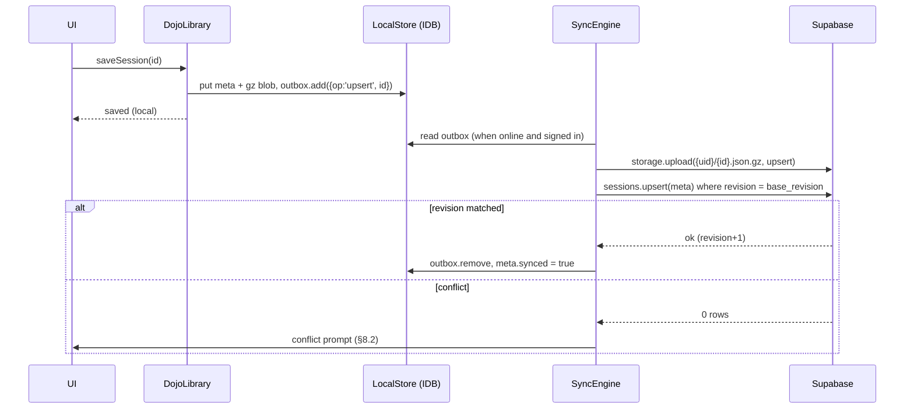

# ARCH: Accounts, Deck Library & Session Library (Supabase)

> **Status:** DRAFT v0.1 for discussion. Nothing here is implemented yet.
> **Scope:** Practice Dojo only (`practice_dojo/practice_dojo.html`), designed to move with the app to
> `PracticeDojo/practicedojo.github.io`.
> **Decisions still open** are marked **❓Q#** and collected in [§13](#13-open-questions).

---

## 1. Goals and non-goals

### Goals
1. **Users have accounts.** Signing in is optional. Without an account the Dojo works exactly as it does today.
2. **Personal deck library.** Import a decklist once (paste, file, Duels.ink replay), name it, and pick it from a list for later matches.
3. **Personal session library.** Save many sessions (multiverse trees), not just the one "Continue" slot. Reopen, rename, delete, and export them, and replay them on any device.
4. **New home screen.** The current setup modal becomes a library-first home screen.
5. **Free tier only.** Everything fits inside one free Supabase project and GitHub Pages, with no server code to run.
6. **Ready for the repo move.** Origins, redirect URLs, and the migration of users' local data are planned ahead of time.

### Non-goals (for this iteration)
- Real-time multiplayer and co-editing a session.
- Social features (follows, comments, likes). Simple "share by link" is in scope as an option (❓Q6).
- Rewriting the session JSON format (*Refactor 1*). We wrap it and gzip it, and leave the inner format alone.
- Changing the other heavenideas tools that use the legacy `decks` table.

---

## 2. Where we are today (as-is)

| Concern | Today | Problem |
|---|---|---|
| **Supabase project** | `cjlhrfhximjldqrfblkj`, shared by about 15 tools in this repo (turnMapper, goldfish, matchup analyzer, deck saver, ...) | The Dojo is tied to everything else in that project |
| **Decks** | Global `decks` table (`id, name, decklist, inks, url, comments, created_at`). No owner column. The Dojo reads **every** row. | No per-user decks. The anon key can insert, update, and delete any row (`personal_deck_saver.js` does this), so anyone holding the public key can wipe the table. |
| **Cloud sessions** | Global `dojo_sessions` table (`id, name, session_data jsonb, created_at`), surfaced as "Cloud demos" | No owner. Anyone can insert. Whole multi-MB sessions are stored as `jsonb` rows, which uses up the 500 MB database quickly. |
| **Local session** | One slot: `localStorage['lorcana_dojo_session']` | localStorage holds about 5 MB per origin, and `saveToLocalStorage()` swallows the quota error. Large multiverses fail to save **without telling the user**. |
| **Card DB cache** | IndexedDB `lorcana_dojo_cache` | Fine. It can be reused as the local store. |
| **Session file** | `exportTimelines()` → `{version:1, currentState, bookmarks, autoSaves, history, deck1, deck2}` | Very large (see below) |
| **Auth** | None, anywhere in the repo | — |

### Measured session sizes (from `multiverse_examples/`)

| File | Raw JSON | gzip | Ratio |
|---|---|---|---|
| `multiverse_session_example_02.json` (11 nodes, 3 autosaves) | **13.2 MB** | **210 KB** | 63× |
| `multiverse_session_example_01.json` | **76.7 MB** | **1.2 MB** | 63× |

`bookmarks` alone is 9.3 MB of the 13 MB, because every node stores a stringified full-state snapshot that includes the log. **Conclusion: sessions must be gzipped and stored as files (Supabase Storage), never as `jsonb` rows.** The browser's native `CompressionStream('gzip')` does this with no library.

---

## 3. Free-tier budget

Supabase Free (verify on the pricing page before building; these figures are as of mid-2026):

| Resource | Free limit | What uses it here | Headroom |
|---|---|---|---|
| Postgres size | 500 MB | Deck rows (about 2 KB each) and session **metadata** rows (about 1 KB each) | Hundreds of thousands of rows |
| File storage | 1 GB | Gzipped session blobs (about 200 KB typical, about 1–2 MB large) | About 5,000 typical sessions in total. **Per-user quotas are needed** (§6.4). |
| Egress | 5 GB / month | Opening sessions from the cloud | About 25,000 opens of a 200 KB session per month |
| Max upload size | 50 MB per file | One session blob | Fine once gzipped |
| Auth MAU | 50,000 | Signed-in users | Plenty |
| Projects | 2 active | — | We can afford a dedicated Dojo project (❓Q1) |
| **Pausing** | Paused after **7 days with no activity** | — | Real users keep it awake. During quiet periods the app must **degrade to local-only** cleanly (§8.4). |
| **Built-in email** | About 2 emails per hour, **only to project team members** | Magic links and password resets | Email login needs **custom SMTP** (for example the Resend free tier). This is why OAuth is recommended (❓Q2). |

---

## 4. Proposed architecture (to-be)

```
┌───────────────────────── Browser (GitHub Pages, static) ─────────────────────────┐
│                                                                                    │
│   Home / Library UI  ──►  DojoLibrary (facade)                                     │
│   Game board (App)        │   listDecks / saveDeck / listSessions / openSession…   │
│                           │                                                        │
│               ┌───────────┴────────────┐                                           │
│               ▼                        ▼                                           │
│        LocalStore (IndexedDB)    CloudStore (supabase-js)  ◄── DojoAuth            │
│        • always on               • only when signed in                             │
│        • source of truth for UI  • decks & session_meta: Postgres + RLS            │
│        • outbox of pending sync  • session blobs: Storage (gzip)                   │
│                                                                                    │
│                         SyncEngine (outbox → cloud, cloud → local)                 │
└────────────────────────────────────────────────────────────────────────────────────┘
                                     │ HTTPS (anon key + user JWT)
                                     ▼
┌──────────────────────── Supabase (free project) ────────────────────────┐
│  Auth (Discord / Google OAuth; optional email)                           │
│  Postgres: profiles, decks, sessions  ── Row Level Security per owner    │
│  Storage:  bucket `sessions` (private) → {user_id}/{session_id}.json.gz  │
└──────────────────────────────────────────────────────────────────────────┘
```

**Principle: local first, cloud second.** The UI always reads from and writes to IndexedDB. The cloud is a sync target that only exists when the user is signed in. This gives us:
- a working Dojo when signed out, offline, or while the free project is paused;
- an end to the 5 MB localStorage limit, because IndexedDB holds hundreds of MB;
- one code path for every read and write, so the UI never asks whether it is talking to the cloud.

### 4.1 Modules (inside `practice_dojo.html`)

The dev guide requires one HTML file. These are namespaced objects next to `App`, in the same style as today (❓Q8 asks whether the new repo should loosen this rule):

| Module | Responsibility |
|---|---|
| `DojoAuth` | Wraps `supabase.auth`: `signIn(provider)`, `signOut()`, `onChange(cb)`, `user`, `profile` |
| `LocalStore` | IndexedDB `practice_dojo` database. Object stores: `decks`, `sessions_meta`, `session_blobs`, `outbox`, `kv`. The existing card cache moves here or stays separate. |
| `CloudStore` | Thin supabase-js calls: decks CRUD, sessions_meta CRUD, blob upload and download |
| `SyncEngine` | Pushes the outbox when online and signed in. Pulls changes since `last_pulled_at`. Resolves conflicts (§8.2). |
| `DojoLibrary` | The facade the UI calls. Hides local and cloud. Emits change events so lists re-render. |
| `SessionCodec` | `encode(App) → Blob(gzip)`, `decode(Blob) → session v1 object`, `summarize(session) → summary` (reuses `buildSessionSummary()`) |

`App` changes are small. `saveToLocalStorage()`, `loadFromLocalStorage()`, `exportTimelines()`, `importTimelines()`, `saveSessionToCloud()`, and `loadExampleSession()` all become thin calls into `DojoLibrary` and `SessionCodec`.

---

## 5. Data model

### 5.1 Entities

```
profiles 1 ──── * decks
profiles 1 ──── * sessions ── (blob in Storage)
sessions * ──── 0..1 decks (p1_deck_id, p2_deck_id)   -- soft link; the deck text is also snapshotted
```

**Why snapshot deck text on the session?** A user edits a deck after playing with it. The saved session must still describe what was actually played, and deleting a deck must not break old sessions. The session keeps `deck1`/`deck2` text, as v1 already does, and gains an optional link back to the library deck.

### 5.2 SQL (draft migration: `supabase/migrations/0001_dojo_library.sql`)

```sql
-- ── profiles ───────────────────────────────────────────────────────────
create table public.profiles (
  id            uuid primary key references auth.users on delete cascade,
  display_name  text check (char_length(display_name) <= 40),
  role          text not null default 'user' check (role in ('user','admin')),
  created_at    timestamptz not null default now()
);

-- auto-create a profile on signup
create function public.handle_new_user() returns trigger
language plpgsql security definer set search_path = public as $$
begin
  insert into public.profiles (id, display_name)
  values (new.id, coalesce(new.raw_user_meta_data->>'full_name', new.raw_user_meta_data->>'name'));
  return new;
end $$;
create trigger on_auth_user_created after insert on auth.users
  for each row execute function public.handle_new_user();

-- ── decks ──────────────────────────────────────────────────────────────
create table public.decks (
  id           uuid primary key default gen_random_uuid(),   -- client-generated so offline creates work
  owner_id     uuid not null default auth.uid() references public.profiles on delete cascade,
  name         text not null check (char_length(name) between 1 and 80),
  decklist     text not null check (char_length(decklist) <= 8000),  -- canonical "4 Full Name" lines
  inks         text[] not null default '{}',
  card_count   smallint,
  source       text check (source in ('paste','file','duels_replay','duels_log','legacy','other')),
  source_url   text,
  notes        text check (char_length(notes) <= 4000),
  is_public    boolean not null default false,
  created_at   timestamptz not null default now(),
  updated_at   timestamptz not null default now(),
  deleted_at   timestamptz                                     -- tombstone so deletes sync
);
create index on public.decks (owner_id, updated_at desc);

-- ── sessions (metadata only; payload lives in Storage) ────────────────
create table public.sessions (
  id              uuid primary key default gen_random_uuid(),
  owner_id        uuid not null default auth.uid() references public.profiles on delete cascade,
  title           text not null check (char_length(title) between 1 and 120),
  kind            text not null default 'sandbox'
                    check (kind in ('sandbox','duels_replay','duels_log','imported_file')),
  p1_deck_id      uuid references public.decks on delete set null,
  p2_deck_id      uuid references public.decks on delete set null,
  summary         jsonb not null default '{}',   -- {inks:[[..],[..]], turn, lore:[a,b], nodes, lines}
  format_version  smallint not null default 1,
  blob_path       text,                          -- {owner_id}/{id}.json.gz
  blob_bytes      integer,
  revision        integer not null default 1,    -- optimistic concurrency (§8.2)
  is_public       boolean not null default false,
  is_featured     boolean not null default false, -- curated "demos"; admin only
  created_at      timestamptz not null default now(),
  updated_at      timestamptz not null default now(),
  last_opened_at  timestamptz,
  deleted_at      timestamptz
);
create index on public.sessions (owner_id, updated_at desc);
create index on public.sessions (is_featured) where is_featured;

-- updated_at + revision bump
create function public.touch() returns trigger language plpgsql as $$
begin new.updated_at := now(); return new; end $$;
create trigger decks_touch    before update on public.decks    for each row execute function public.touch();
create trigger sessions_touch before update on public.sessions for each row execute function public.touch();
```

### 5.3 Row Level Security

```sql
alter table public.profiles enable row level security;
alter table public.decks    enable row level security;
alter table public.sessions enable row level security;

create policy "own profile"      on public.profiles for all
  using (id = auth.uid()) with check (id = auth.uid() and role = 'user');

create policy "read own or public decks" on public.decks for select
  using (owner_id = auth.uid() or (is_public and deleted_at is null));
create policy "write own decks"  on public.decks for insert with check (owner_id = auth.uid());
create policy "update own decks" on public.decks for update using (owner_id = auth.uid());
create policy "delete own decks" on public.decks for delete using (owner_id = auth.uid());

create policy "read own/public/featured sessions" on public.sessions for select
  using (owner_id = auth.uid() or ((is_public or is_featured) and deleted_at is null));
create policy "write own sessions"  on public.sessions for insert
  with check (owner_id = auth.uid() and is_featured = false);
create policy "update own sessions" on public.sessions for update
  using (owner_id = auth.uid())
  with check (owner_id = auth.uid()
              and (is_featured = false
                   or exists (select 1 from profiles where id = auth.uid() and role = 'admin')));
create policy "delete own sessions" on public.sessions for delete using (owner_id = auth.uid());
```

The anon (signed-out) role sees only `is_public` and `is_featured` rows. That is how today's "Cloud demos" keep working for everyone.

### 5.4 Storage

- Bucket **`sessions`**: private, `file_size_limit = 10 MB`, allowed MIME `application/gzip`.
- Object path: `{auth.uid()}/{session_id}.json.gz`

```sql
create policy "own session blobs" on storage.objects for all
  using (bucket_id = 'sessions' and (storage.foldername(name))[1] = auth.uid()::text)
  with check (bucket_id = 'sessions' and (storage.foldername(name))[1] = auth.uid()::text);

-- public/featured sessions readable by anyone
create policy "public session blobs" on storage.objects for select
  using (bucket_id = 'sessions' and exists (
    select 1 from public.sessions s
    where s.blob_path = storage.objects.name and (s.is_public or s.is_featured) and s.deleted_at is null));
```

---

## 6. Session payload

### 6.1 Envelope (format v2 = v1 + header, gzipped)

```jsonc
{
  "format": "practice-dojo-session",
  "version": 2,
  "app": "v2.19.0",                 // Dojo version that wrote it
  "id": "uuid",                      // == sessions.id
  "title": "Amber/Steel vs Ruby/Sapphire — T8 study",
  "savedAt": 1759600000000,
  "summary": { ... },                // same as buildSessionSummary()
  "decks": { "p1": { "id": "uuid|null", "text": "4 ..." }, "p2": { ... } },
  "data": {                          // UNCHANGED v1 payload
    "currentState": {...}, "bookmarks": [...], "autoSaves": [...], "history": [...]
  }
}
```

- `SessionCodec.decode()` accepts **v2 gzipped**, **v2 plain**, and **v1 plain** (today's `.json` exports), so old files keep importing.
- **Export** downloads `*.dojo.json.gz` by default, with a plain `.json` option for hand inspection.
- *Refactor 1* (deduplicating node snapshots) can come later behind `version: 3` without touching this design.

### 6.2 What "replay" means here (❓Q4)

The Dojo already lets you reopen a session and navigate the multiverse tree. The doc assumes that **reopening and navigating** is the replay you want, which this design covers. Two additions are possible if you want them:
- **(a) Playback mode:** a "▶ Play" control that steps through the tree's main line node by node on a timer, read-only.
- **(b) Keep the original Duels.ink file:** store the raw `.replay` or `.md` next to the session so it can be re-imported later as the importer improves.

### 6.3 Autosave policy

| Trigger | Local (IndexedDB) | Cloud |
|---|---|---|
| Every state mutation (debounced 1 s) | ✅ overwrite current session blob | — |
| New bookmark or node created | ✅ | queue in outbox |
| Explicit "Save" | ✅ | ✅ immediately |
| Tab hidden (`visibilitychange`) or every 3 min while dirty | ✅ | ✅ if dirty |

This keeps uploads and egress low: a long session uploads a few times, not on every click.

### 6.4 Quotas (to protect the shared 1 GB)

- Up to **50 cloud sessions** and **200 decks** per user, enforced by a `before insert` trigger that counts rows where `deleted_at is null`.
- At most **10 MB per blob**, enforced by the bucket limit.
- The UI shows usage ("23 / 50 sessions · 18 MB") in the account menu.
- Local-only sessions are unlimited, bounded only by browser storage.

---

## 7. Home screen (replaces `#setup-modal`)

### 7.1 Layout

```
┌──────────────────────────────────────────────────────────────────────────┐
│ ◆ Practice Dojo  v2.19.0                       ☁ Synced  [ (A) Ana ▾ ]    │
│                                                     or [ Sign in ]        │
├──────────────────────────────────────────────────────────────────────────┤
│ ┌ Continue ───────────────────────────────────────────────────────────┐  │
│ │ ●● Amber/Steel  vs  ●● Ruby/Sapphire · Turn 8 · 11 nodes · 2h ago    │  │
│ │                                                  [ Resume match ]   │  │
│ └─────────────────────────────────────────────────────────────────────┘  │
│                                                                          │
│  [ New match ]  [ Sessions (12) ]  [ Decks (7) ]  [ Demos ]   ← tabs     │
│ ──────────────────────────────────────────────────────────────────────── │
│  NEW MATCH                                                               │
│  ┌ Player 1 · You ───────────────┐   ┌ Player 2 · Opponent ──────────┐   │
│  │ [ My decks ▾ ] [ Paste ]      │   │ [ My decks ▾ ] [ Paste ]      │   │
│  │ ●● Amber/Steel Songs (60)     │   │ ●● Ruby/Sapphire (60)         │   │
│  │ ☐ Save pasted list to library │   │ ☐ Save pasted list to library │   │
│  └───────────────────────────────┘   └───────────────────────────────┘   │
│                                                       [ Start match → ]  │
│                                                                          │
│  Open existing:  [ Import .json/.gz ]  [ Duels.ink log / replay ]        │
└──────────────────────────────────────────────────────────────────────────┘
```

**Sessions tab:** a list with ink pips, title, turn, lore, node count, updated time, and a ☁ or 💻 badge showing where the session lives. Row actions: Open, Rename, Duplicate, Export, Delete, and Upload to cloud for local-only sessions. Search and filter by ink.

**Decks tab:** a list with pips, name, card count, and updated time. Actions: Play as P1, Play as P2, Edit (name, list, notes), Duplicate, Export text, and Delete. **Import deck** opens a modal (paste, `.txt`, or "from a Duels.ink replay" using the replay's exact `decklist` field). It validates through the existing `parseDeck()` and checks `checkDeckInput()`.

**Demos tab:** the curated `is_featured` sessions, which replace today's "Cloud demos" dropdown. Anyone can see them, signed in or not.

### 7.2 Flows

- **Start a match:** pick or paste two decks → `startGame()` → a new session row is created locally (`kind: 'sandbox'`) with deck snapshots → autosave takes over.
- **Duels.ink import:** create a session (`kind: 'duels_replay'` or `'duels_log'`). For replays, offer "Save *your* decklist to the library" because the file has the exact 60 cards.
- **Continue card:** shows the most recent `last_opened_at` session from the local store, not the old single localStorage slot.
- **Signed out:** everything works. Lists show local items only, and a subtle prompt reads "Sign in to sync across devices."
- **First sign-in on a device that has local items:** a dialog asks "Upload 4 decks and 3 sessions from this device to your account?" with the options *Upload all*, *Choose…*, or *Not now*.

### 7.3 In-game changes
- The topbar "Save to cloud" button becomes **Save** (local always, and cloud when signed in) and **Save as…** (fork to a new session id).
- The session title is shown and can be edited in the topbar.
- The sync indicator shows ☁ synced, ↻ syncing, ⚠ offline (saved locally), or ⏸ cloud paused.

---

## 8. Sync design

### 8.1 Outbox pattern



- Deletes write `deleted_at`, a tombstone, so other devices learn about them. A monthly job or a manual purge clears blobs of tombstoned sessions.
- Pull runs on sign-in, on focus, and every 5 minutes: `select … where updated_at > last_pulled_at`. Blobs download **lazily** when a session is opened, which keeps egress small.

### 8.2 Conflicts

Sessions are large and opaque, so we never merge them. **Last-writer-wins with detection:** the update includes `revision = base_revision`. On a mismatch the user chooses *Keep mine (overwrite)*, *Keep cloud*, or *Keep both (save mine as copy)*. Decks are small, so the same rule applies, defaulting to keep-both.

### 8.3 Identity of local items
All ids are UUIDs generated on the client (`App.uuid()` already exists). A local item and its cloud copy share one id, so no remapping is needed.

### 8.4 Cloud unavailable or paused
Any Supabase failure, including the free-tier pause, leaves items in the outbox with an ⚠ badge. The app stays fully usable. Today's "Cloud unavailable — paste a decklist" fallback generalizes to the whole library.

---

## 9. Authentication

| Option | Pros | Cons |
|---|---|---|
| **Discord OAuth** | Where the Lorcana community lives. One click, no email needed. | Requires a Discord developer app (free) |
| **Google OAuth** | Universal | Requires a Google Cloud OAuth client (free) |
| GitHub OAuth | Trivial to set up | Few players have accounts |
| Email magic link | No third party | **Needs custom SMTP** on the free tier (Resend or similar), plus deliverability work |
| Anonymous sign-in (Supabase) | Cloud sync with no sign-up, upgradable later | Anonymous accounts are lost if the browser is cleared, and anon-user abuse counts against quotas |

**Recommendation:** Discord and Google at launch, with email magic link later if requested (❓Q2).

**GitHub Pages specifics:**
- Use the PKCE flow (`flowType: 'pkce'`, the supabase-js v2 default). The redirect lands back on the page with `?code=`, and supabase-js exchanges it.
- *Auth → URL Configuration*: Site URL `https://practicedojo.github.io`. Additional redirects: `https://heavenideas.github.io/practice_dojo/**` (until the move) and `http://localhost:*/**`.
- The anon key stays in the HTML, which is safe **only because** RLS is on every table and bucket.
- Pin the CDN version (`@supabase/supabase-js@2.x.y`) instead of `@2` so a release can't break login without warning.

---

## 10. Which Supabase project? (❓Q1)

| | **A. New dedicated "practicedojo" project** (recommended) | B. Reuse `cjlhrfhximjldqrfblkj` |
|---|---|---|
| Isolation from the legacy anon-writable tables | ✅ Clean RLS-only schema | ⚠ Legacy `decks` and `dojo_sessions` coexist. The new table needs another name (`dojo_decks`) or a separate schema. |
| Free quota | Its own 500 MB, 1 GB, and 5 GB | Shared with about 15 tools |
| Fits the PracticeDojo brand and repo move | ✅ | ✗ Tied to heavenideas |
| Uses the second free project slot | Yes | No |
| Pause risk | The Dojo alone must keep it active | Other tools keep it awake |
| Getting your existing decks over | A one-time **"Import from legacy library"** that reads the old `decks` table with the old anon key, read-only | Direct |

**Demo migration:** copy each `dojo_sessions` row to a gzipped blob plus a `sessions` row owned by your admin user with `is_featured = true`. This is a one-off Node or browser script kept in `supabase/scripts/`.

**Security note (outside this doc's scope, but you should know):** the legacy `decks` and `dojo_sessions` tables can be written and deleted by anyone who has the public anon key embedded in these pages. If option A is chosen, consider making the legacy tables read-only for `anon` once the deck saver has its own auth.

---

## 11. Repo migration considerations

1. **localStorage and IndexedDB are per-origin.** Data saved at `heavenideas.github.io` is **not visible** at `practicedojo.github.io`. That makes shipping accounts *before* the move the right order: users sign in on the old origin, sync, then sign in on the new one. Fallbacks for signed-out users:
   - a one-click **"Export everything"** (one `.zip` or a multi-session file) on the old origin;
   - a stub page at the old URL saying "We moved" that links to the new site and offers that export.
2. **Layout in the new repo (proposal):**
   ```
   /index.html             ← landing (today's practice_dojo/index.html)
   /app/index.html         ← the Dojo (today's practice_dojo.html)   (❓Q7: or the app at root?)
   /supabase/migrations/   ← SQL above, versioned
   /supabase/scripts/      ← demo + legacy import scripts
   /docs/                  ← dev guide, features.md, ARCH-*, TEST-PROTOCOL-*
   ```
3. **Leave the large artifacts behind:** `multiverse_examples/*.json` (77 MB and 13 MB) and the `_bundle/` chunk loader. Demos live in Supabase. If example files are still wanted in the repo, keep them gzipped (1.2 MB and 210 KB).
4. Update the OAuth redirect URLs and the Supabase Site URL on cutover day.

---

## 12. Implementation phases

Each phase ships on its own and gets a Feature number in `features.md`.

| Phase | Delivers | Needs an account? |
|---|---|---|
| **0. Backend setup** | Supabase project, migration SQL, bucket and policies, OAuth providers, admin profile | — |
| **1. Local library** | `LocalStore` (IndexedDB), `SessionCodec` (gzip v2), multi-session and deck library, new home screen. Fixes the silent 5 MB save failure. | No |
| **2. Auth + deck sync** | `DojoAuth`, sign-in UI, `CloudStore` decks, `SyncEngine` outbox, first-sign-in upload dialog, legacy deck import | Yes |
| **3. Session sync** | Blob upload and download, lazy fetch, conflicts, quotas, Demos tab on `is_featured` | Yes |
| **4. Sharing and replay extras** | Public link `?s=<id>` (if ❓Q6), playback mode (if ❓Q4a), keep the raw Duels.ink file (if ❓Q4b) | Optional |
| **5. Repo move** | New repo layout, redirects, "we moved" stub, export-everything | — |

Phase 1 is useful on its own and carries no backend risk, which makes it a good first PR.

---

## 13. Open questions

| # | Question | Default if unanswered |
|---|---|---|
| **Q1** | New dedicated Supabase project, or reuse the existing one? | **New project** (§10) |
| **Q2** | Which sign-in methods? Discord, Google, GitHub, email magic link (needs SMTP), anonymous? | **Discord + Google** |
| **Q3** | Should signed-out users keep full local functionality, or is the library an account-only feature? | **Full local functionality** |
| **Q4** | What does "replay" mean to you: (a) reopen and navigate (exists), (b) auto-playback through the main line, (c) keep the original Duels.ink file for re-import? | **(a) now; (b) and (c) in Phase 4** |
| **Q5** | Should P2 (opponent) decks also live in the library, perhaps tagged "Opponent / Meta"? Or only your own decks? | **One library with an optional tag** |
| **Q6** | Sharing: should a session or deck be shareable by link (read-only, opens as a copy)? | **Yes, Phase 4, off by default** |
| **Q7** | New repo URL layout: Dojo at `/` with the landing elsewhere, or landing at `/` and the app at `/app/`? | **Landing `/`, app `/app/`** |
| **Q8** | Keep the strict single-file rule in the new repo, or allow a few `js/*.js` modules (auth, store, sync)? | **Keep single file** |
| **Q9** | Who curates the Demos? Only you as admin, or can users "publish" sessions? | **Admin only** |
| **Q10** | Quotas: are 50 cloud sessions and 200 decks per user acceptable? | **Yes** |
| **Q11** | Should your existing decks in the legacy `decks` table be imported into your account, and should other users see a "legacy library" at all? | **Import to your account only** |
| **Q12** | Do the other heavenideas tools (turnMapper, goldfish, ...) need to read Dojo decks later? That would favour reusing the project. | **No** |
